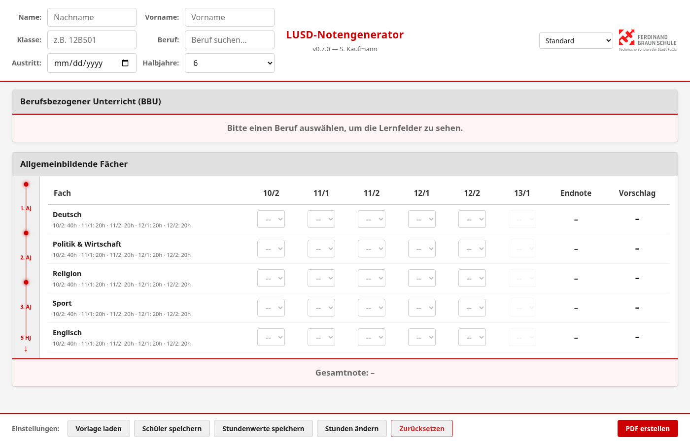
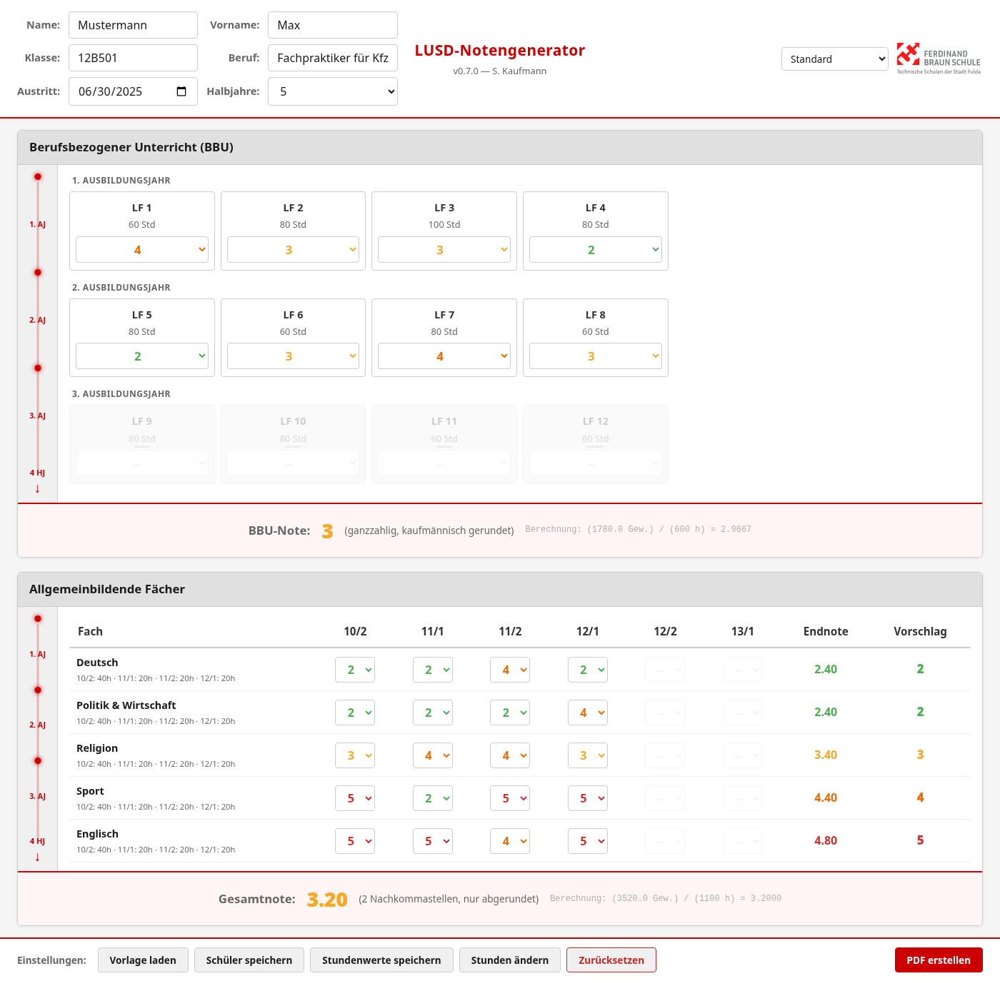
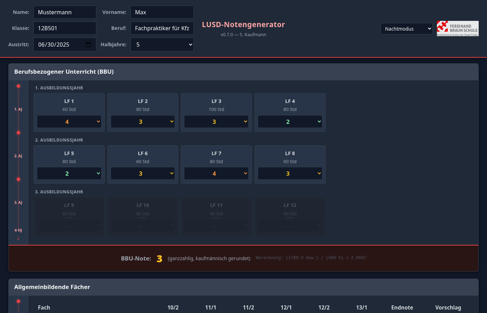
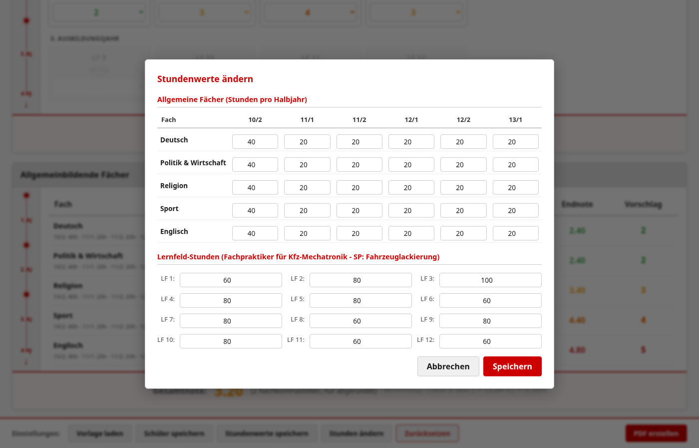

# LUSD Notengenerator (BS)

Zeugnisnoten-Berechnung für hessische Berufsschulen — Web-App mit PDF-Export.

## Screenshots

| Leere Eingabe | Mit Noten |
|---|---|
|  |  |

| Nachtmodus | Einstellungen |
|---|---|
|  |  |

## Was macht das Tool?

An Berufsschulen müssen Lehrkräfte für Abgangs- und Abschlusszeugnisse gewichtete Durchschnittsnoten berechnen. Die BBU-Note (Berufsbezogener Unterricht) ergibt sich aus den Lernfeld-Noten, gewichtet nach Unterrichtsstunden. Die Gesamtnote kombiniert BBU und allgemeine Fächer. Dieses Tool übernimmt die Berechnung und erstellt ein fertiges PDF.

## Features

- **Notenberechnung** — Gewichtete Durchschnitte für BBU und Gesamtnote, nach Stundentafel; BBU-Note wird immer abgerundet
- **Zeugnistyp** — Auswahl Abschluss- oder Abgangszeugnis direkt im Header; erscheint im PDF-Titel
- **Alle hessischen Ausbildungsberufe** — Beruf suchen, Lernfelder und Stunden werden automatisch geladen
- **Semester-Filter** — Je nach Ausscheide-Semester werden nur die relevanten Lernfelder angezeigt
- **Schnelle Noteneingabe** — Inline-Skala mit Zifferntasten, kein Tippen nötig
- **PDF-Export** — LF-Tabelle nach Ausbildungsjahr gegliedert (dynamisch nach Stundengrenzen), Logos, Unterschriftsfeld
- **Entwürfe** — Eingaben werden automatisch gespeichert (localStorage) und können später fortgesetzt werden
- **Undo** — Strg+Z macht die letzte Notenänderung rückgängig
- **Tastaturkürzel** — Strg+P (PDF), Strg+S (Gespeichert-Toast), Esc (Modal schließen)
- **Vorlagen** — Stundenwerte und Schülerdaten als Vorlage speichern/laden
- **Einstellungen** — Stunden pro Halbjahr und Lernfeld-Stunden anpassen (auch Dezimalwerte, z. B. 12,5 h)
- **Dark/Light Mode** — Automatisches Theme basierend auf Systemeinstellung

## Installation

### Als Standalone-Binary (empfohlen)

Binary von der [GitHub Releases-Seite](https://github.com/Baulehrer/LUSD-Notengenerator-BS/releases) herunterladen und ausführen.

### Aus dem Source-Code

Voraussetzung: [Bun](https://bun.sh) installiert.

```bash
cd Skript
bun install
bun run start
```

Der Server startet auf `http://localhost:3000` und öffnet automatisch den Browser.

### Entwicklungsmodus

```bash
cd Skript
bun run dev        # Dev-Server mit HMR
bun test           # Tests ausführen (69 Tests)
bun run typecheck  # TypeScript-Prüfung
bun run lint       # Biome Lint
bun run format     # Biome Formatierung
```

## Architektur

```
Skript/
├── main.ts              # Einstiegspunkt → Bun.serve auf Port 3000
├── server.ts            # REST-API (berufe, pdf, einstellungen, templates, logo)
├── core/grades.ts       # Notenberechnung (client + server)
├── shared/constants.ts  # Zentrale Konstanten (LERNFELDER, FAECHER, etc.)
├── types/index.ts        # Domain-Typen (Schueler, Beruf, Berechnungsergebnis)
├── config/              # Pfade, Einstellungen, Vorlagen
├── import/              # Excel-Parser (Berufe) und LUSD-Parser
├── export/pdf.ts         # PDF-Generierung (pdfkit, lazy-loaded)
├── web/                 # React 19 Frontend
│   ├── app.tsx           # Root-Komponente
│   ├── components/       # Header, LernfelderGrid, AllgFaecher, Einstellungen, etc.
│   ├── hooks/            # useSchueler, useAutosave, useUndo, useTheme, useTemplates
│   └── styles/           # global.css, components.css
└── tui/                  # Dormant — nicht aktiv
```

**Wichtige Punkte:**
- Notenberechnung läuft **clientseitig** im Browser (kein `/api/calculate`-Endpoint)
- PDF-Generierung ist **serverseitig** (`POST /api/pdf`), pdfkit wird per Dynamic Import geladen
- `shared/constants.ts` ist die Single Source of Truth für alle Konstanten
- `config/paths.ts` erkennt kompilierte Binary vs. Dev-Modus

## Tastaturkürzel

| Kürzel | Aktion |
|--------|--------|
| Strg+Z / Cmd+Z | Letzte Notenänderung rückgängig machen |
| Strg+P / Cmd+P | PDF erstellen |
| Strg+S / Cmd+S | Gespeichert-Toast anzeigen |
| Esc | Modal schließen |

## Changelog

### v0.8.0
- BBU-Note wird jetzt **immer abgerundet** (Math.floor, nicht kaufmännisch)
- **Zeugnistyp-Auswahl** (Abschluss / Abgang) im Header, wirkt sich auf PDF-Titel aus
- Stunden-Inputs erlauben **Dezimalwerte** (z. B. 12,5 h, step 0,5)
- PDF: Lernfelder werden **nach Ausbildungsjahr gegliedert** (1./2./3. AJ, dynamisch nach kumulativen Stundengrenzen)

### v0.7.0
- Web-UI als primäre Oberfläche (React 19 + Bun.serve)
- Notenberechnung **clientseitig** (kein Server-Roundtrip für `/api/calculate`)
- Zentrale Konstanten in `shared/constants.ts`
- Biome 2.4.10 als Linter/Formatter, CI-Workflow, Pre-Commit-Hook

### v0.6.0
- Web-UI Migration, per-Fach-Stunden, Templates, Undo, Autosave
- GitHub Actions Release-Workflow

## Lizenz

MIT

## Autor

Stephan Kaufmann
